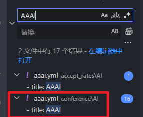
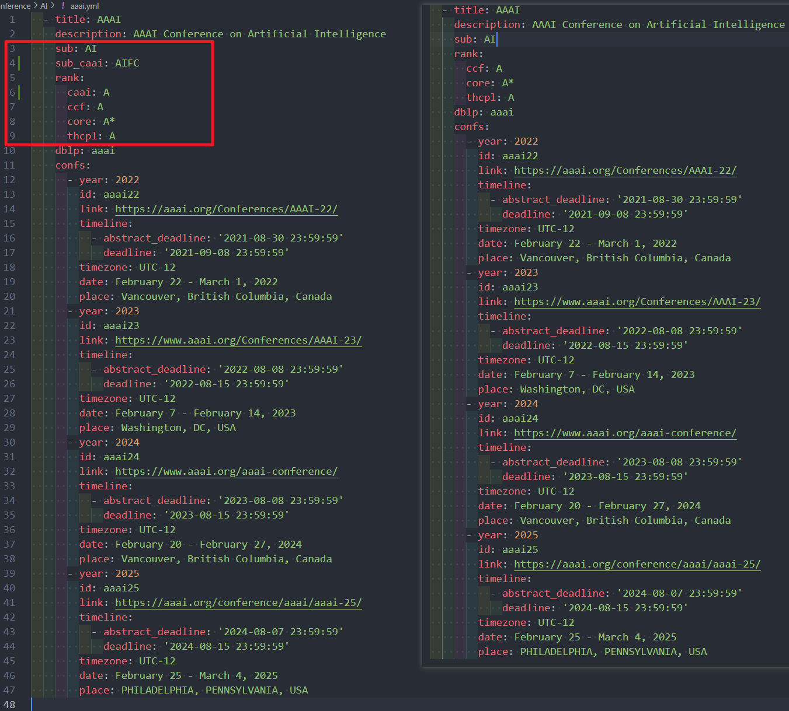
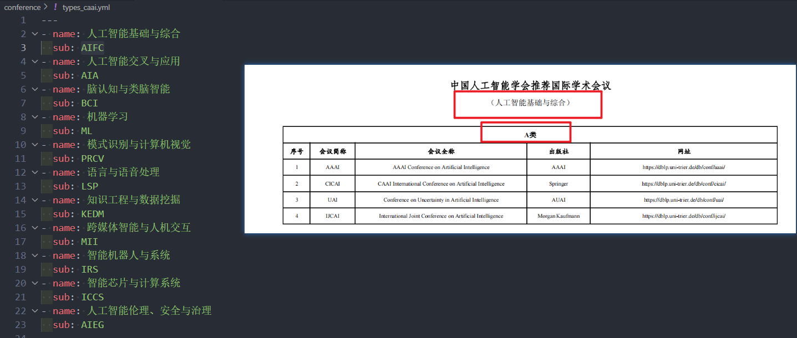
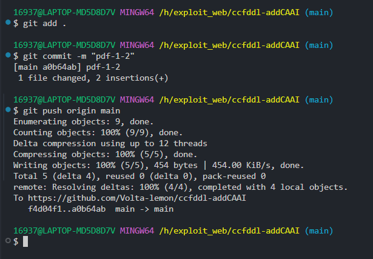
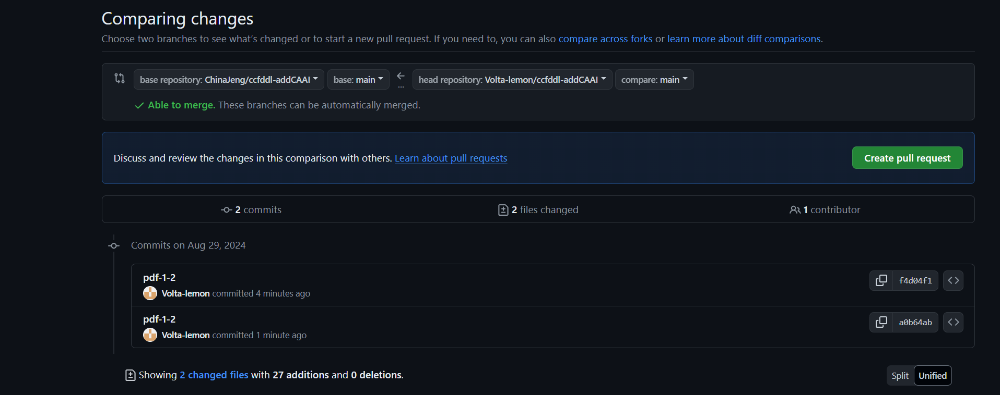
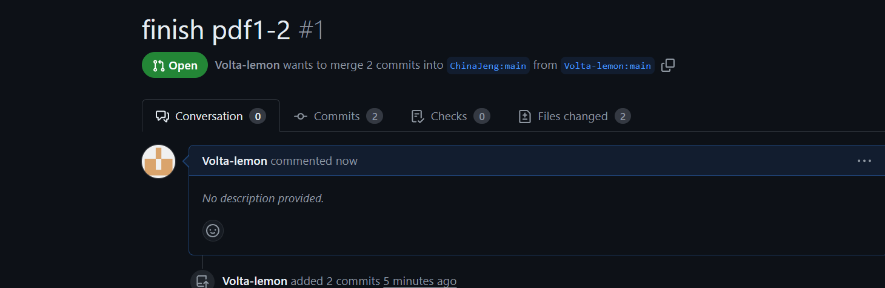

# 维护 MMAI会议DDL项目说明文档（github协作）

## CCF-Deadlines（添加CAAI目录版）

[原项目](https://github.com/ccfddl/ccf-deadline)

## 1. 任务

1. 修改（或增加）自己对应的CAAI会议yml文件后在仓库进行提交
2. 维护不同年度的截稿日期

## 2. 任务执行流程

1. Fork项目：https://github.com/ChinaJeng/ccfddl-addCAAI

2. 获取自己的仓库链接：https://github.com/xxxxx/ccfddl-addCAAI

3. 查看https://www.caai.cn/index.php?s=/home/article/detail/id/4024.html，按页码完成对应工作，根据图片上每一个会议，找到对应 conference/XX/xxxx.yml 文件：

      - 在sub属性下面添加一个同级属性sub_caai，值为该会议**CAAI分类**的字母代号，字母代号在 conference/types_caai.yml 里有对应
      - 在rank属性下面添加一个子属性caai，值为该会议的**CAAI等级**（A类、B类、C类）
      - 若没有该会议的yml文件，则新建一个，搜索该会议的信息，格式仿照其他的

4. 使用vscode打开本地仓库,搜索需要修改的期刊会议名称

   

5. 如果在conference中包含，那么直接修改对应的yml文件，按照pdf以及type_caai.yml对应修改

   

   

6. 如果在conference中不包含，新建对应类别文件夹，新增yml文件，根据网址获得相应信息，如果搜索不到相关信息，只填写基本信息即可。

7. 更新完成后进行提交，提交信息为"pdf-页码范围"

7. 创建pr等待合并，title设为finish pdf页码范围

## 3. 字段与匹配表

字段描述:

<table>
   <tr>
      <th colspan="3">字段名</th>
      <th>描述</th>
   </tr>
   <tr>
      <td colspan="3"><code>title</code>*</td>
      <td>缩写的会议名称, 不需要年份, 大写</td>
   </tr>
   <tr>
      <td colspan="3"><code>description</code>*</td>
      <td>介绍, 或全称, 无需第几届</td>
   </tr>
   <tr>
      <td colspan="3"><code>sub</code>*</td>
      <td>会议在CCF中被标注的类别, 可参考下面的辅助文档</td>
   </tr>
    <tr>
      <td colspan="3"><code>sub_caai</code></td>
      <td>会议在CAAI中被标注的类别, 可参考下面的辅助文档</td>
   </tr>
   <tr>
      <td rowspan="4"><code>rank</code>*</td>
      <td colspan="2"><code>ccf</code>*</td>
      <td>会议在CCF中被标注的等级, 示例, <code>A</code>, <code>B</code>, <code>C</code>, <code>N</code></td>
   </tr>
    <tr>
        <td colspan="2"><code>caai</code></td>
      <td>会议在CAAI中被标注的等级, 示例, <code>A</code>, <code>B</code>, <code>C</code></td>
    </tr>
   <tr>
   <td colspan="2"><code>core</code></td>
   <td>会议在CORE中被标注的等级, 示例, <code>A*</code>,<code>A</code>, <code>B</code>, <code>C</code>, <code>N</code></td>
   </tr>
   <tr>
   <td colspan="2"><code>thcpl</code></td>
   <td>会议在TH-CPL中被标注的等级, 示例, <code>A</code>, <code>B</code>, <code>N</code></td>
   </tr>
   <tr>
      <td colspan="3"><code>dblp</code>*</td>
      <td>会议在dblp的URL的后缀, 示例, <code>iccv</code> in https://dblp.uni-trier.de/db/conf/iccv</td>
   </tr>
   <tr>
      <td rowspan="9"><code>confs</code></td>
      <td colspan="2"><code>year</code>*</td>
      <td>会议的年份</td>
   </tr>
   <tr>
      <td colspan="2"><code>id</code>*</td>
      <td>会议名字和年份, 小写</td>
   </tr>
   <tr>
      <td colspan="2"><code>link</code>*</td>
      <td>会议首页的URL</td>
   </tr>
   <tr>
      <td rowspan="3"><code>timeline</code>*</td>
      <td><code>abstract_deadline</code></td>
      <td>Abstract的截稿日期, 可选填</td>
   </tr>
   <tr>
      <td><code>deadline</code>*</td>
      <td>截稿日期, 格式为 <code>yyyy-mm-dd hh:mm:ss</code> or <code>TBD</code></td>
   </tr>
   <tr>
      <td><code>comment</code></td>
      <td>额外的一些辅助信息, 可选填</td>
   </tr>
   <tr>
      <td colspan="2"><code>timezone</code>*</td>
      <td>截稿日期的时区, 目前支持 <code>UTC-12</code> ~ <code>UTC+12</code> & <code>AoE</code></td>
   </tr>
   <tr>
      <td colspan="2"><code>date</code>*</td>
      <td>会议举办的日期, 示例, Mar 12-16, 2021</td>
   </tr>
   <tr>
      <td colspan="2"><code>place</code>*</td>
      <td>会议举办的地点, 示例, <code>city, country</code></td>
   </tr>
</table>

带星标(*)的字段是必填项。

CAAII类别匹配表:

| `sub`  | 类别名称                 |
| ------ | ------------------------ |
| `AIFC` | 人工智能基础与综合       |
| `AIA`  | 人工智能交叉与应用       |
| `BCI`  | 脑认知与类脑智能         |
| `ML`   | 机器学习                 |
| `PRCV` | 模式识别与计算机视觉     |
| `LSP`  | 语言与语音处理           |
| `KEDM` | 知识工程与数据挖掘       |
| `MII`  | 跨媒体智能与人机交互     |
| `IRS`  | 智能机器人与系统         |
| `ICCS` | 智能芯片与计算系统       |
| `AIEG` | 人工智能伦理、安全与治理 |

