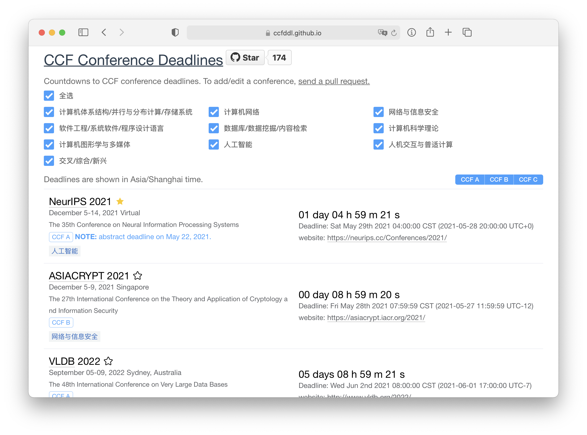

# CCF-Deadlines
[](https://github.com/ccfddl/ccf-deadlines/blob/main/LICENSE)
[](https://github.com/ccfddl/ccf-deadlines/commits/main)
[](https://github.com/ccfddl/ccf-deadlines/pulls)

English | [简体中文](./README.zh-CN.md)

Help researchers track deadlines of conferences recommended by [China Computer Federation (CCF)](https://www.ccf.org.cn/).

Preview: [Demo](https://ccfddl.github.io/)

[](https://github.com/ccfddl/ccf-deadlines/blob/main/.readme_assets/screenshot.png)

**No More Finding and Time Conversion on Your Own!**

## Add/Update a conference
Contributions are welcomed and greatly appreciated! For further contribution and waterblowing, email [chenzh@stu.ecnu.edu.cn](chenzh@stu.ecnu.edu.cn) through your edu email address with wechatid to join the [CCFDDL](https://github.com/ccfddl) organization.

To add or update information:
- Fork the repo
- Add/Update the yml file of conference/conf_type/conf_name.yml
- Send a [pull request](https://github.com/ccfddl/ccf-deadlines/pulls)

Tips: check [conferences recommended](.readme_assets/ccf_recommended.pdf) and review [statistics](https://docs.qq.com/sheet/DR3F1Tm1jcnlzVFJ2)
## Conference Entry File
Example file: conference/DB/sigmod.yml

```
- title: SIGMOD
  description: ACM Conference on Management of Data
  sub: DB
  rank: A
  dblp: sigmod
  confs:
    - year: 2022
      id: sigmod22
      link: http://2022.sigmod.org/
      timeline:
        - deadline: '2021-07-02 17:00:00'
          comment: 'first round'
        - deadline: '2021-09-15 17:00:00'
          comment: 'second round'
      timezone: UTC-8
      date: June 12-17, 2022
      place: Philadelphia, PA, USA
```
Description of the fields:
<table>
   <tr>
      <th colspan="3">Field name</th>
      <th>Description</th>
   </tr>
   <tr>
      <td colspan="3"><code>title</code>*</td>
      <td>Short conference name, without year, uppercase</td>
   </tr>
   <tr>
      <td colspan="3"><code>description</code>*</td>
      <td>Description, or long name, with no session</td>
   </tr>
   <tr>
      <td colspan="3"><code>sub</code>*</td>
      <td>The category that the conference is labeled by CCF. See the matching table below</td>
   </tr>
   <tr>
      <td colspan="3"><code>rank</code>*</td>
      <td>The level that the conference is ranked by CCF, e.g., <code>A</code>, <code>B</code>, <code>C</code></td>
   </tr>
   <tr>
      <td colspan="3"><code>dblp</code>*</td>
      <td>The suffix in dblp url, e.g., <code>iccv</code> in https://dblp.uni-trier.de/db/conf/iccv</td>
   </tr>
   <tr>
      <td rowspan="9"><code>confs</code></td>
      <td colspan="2"><code>year</code>*</td>
      <td>Year the conference is happening</td>
   </tr>
   <tr>
      <td colspan="2"><code>id</code>*</td>
      <td>conference name & year, lowercase</td>
   </tr>
   <tr>
      <td colspan="2"><code>link</code>*</td>
      <td>URL to the conference home page</td>
   </tr>
   <tr>
      <td rowspan="3"><code>timeline</code>*</td>
      <td><code>abstract_deadline</code></td>
      <td>Abstract deadline if applicable, optional</td>
   </tr>
   <tr>
      <td><code>deadline</code>*</td>
      <td>Deadline, in the format of <code>yyyy-mm-dd hh:mm:ss</code> or <code>TBD</code></td>
   </tr>
   <tr>
      <td><code>comment</code></td>
      <td>Some comments on the conference, optional</td>
   </tr>
   <tr>
      <td colspan="2"><code>timezone</code>*</td>
      <td>Timezone of deadline, currently support <code>UTC-12</code> ~ <code>UTC+12</code> & <code>AoE</code></td>
   </tr>
   <tr>
      <td colspan="2"><code>date</code>*</td>
      <td>When the main conference is happening, e.g., Mar 12-16, 2021</td>
   </tr>
   <tr>
      <td colspan="2"><code>place</code>*</td>
      <td>Where the main conference is happening, e.g., <code>city, country</code></td>
   </tr>
</table>

Fields marked with asterisk (*) are required.

The matching table:

| `sub` | Category name |
| ----------- | --------------------------------------------------------- |
| `DS`        | Computer Architecture/Parallel Programming/Storage Technology                   |
| `NW`        | Network System                                              |
| `SC`        | Network and System Security                                           |
| `SE`        | Software Engineering/Operating System/Programming Language Design                            |
| `DB`        | Database/Data Mining/Information Retrieval                                  |
| `CT`        | Computing Theory                                    |
| `CG`        | Graphics                                      |
| `AI`        | Artificial Intelligence                                                  |
| `HI`        | Computer-Human Interaction                                       |
| `MX`       | Interdiscipline/Mixture/Emerging                                            |

## Contribution
Maintained by [@jacklightChen](https://github.com/jacklightChen), [@0x4f5da2](https://github.com/0x4f5da2), [@kzoacn](https://github.com/kzoacn), [@cubercsl](https://github.com/cubercsl), [
@spingARbor](https://github.com/spingARbor), [@liborui](https://github.com/liborui), [@PAN-Ziyue](https://github.com/PAN-Ziyue).

Inspired by [ai-deadlines](https://aideadlin.es/).

## License
[](https://app.fossa.com/projects/git%2Bgithub.com%2Fccfddl%2Fccf-deadlines?ref=badge_large)
