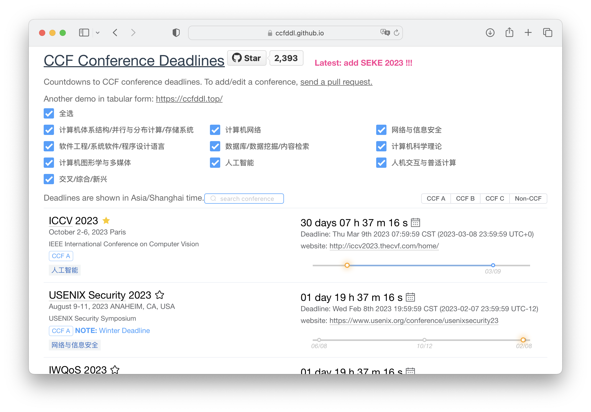
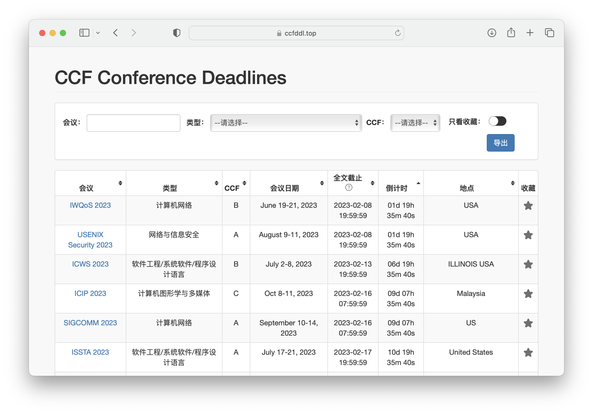
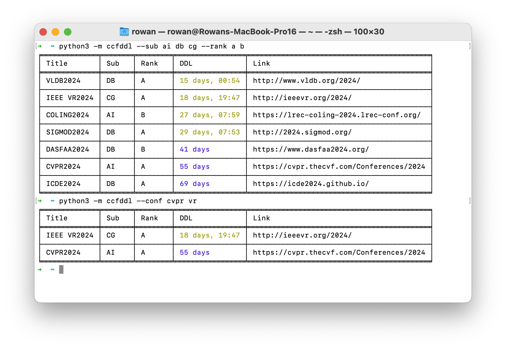
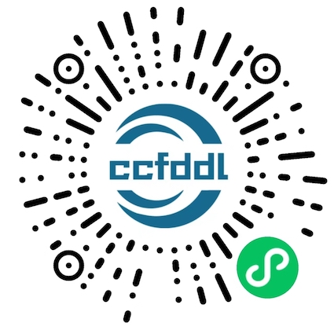
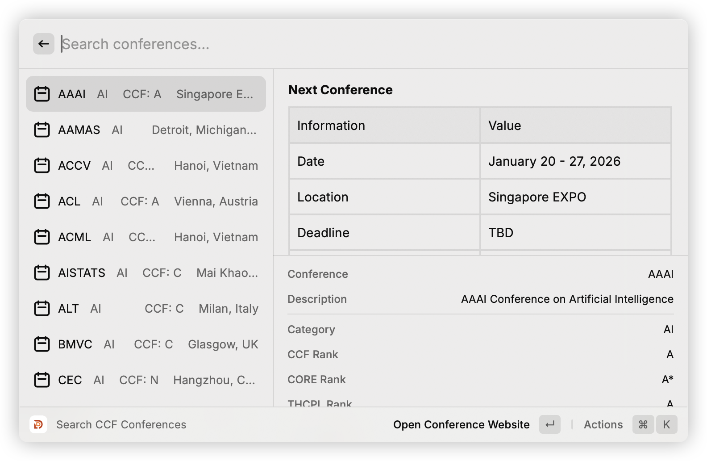
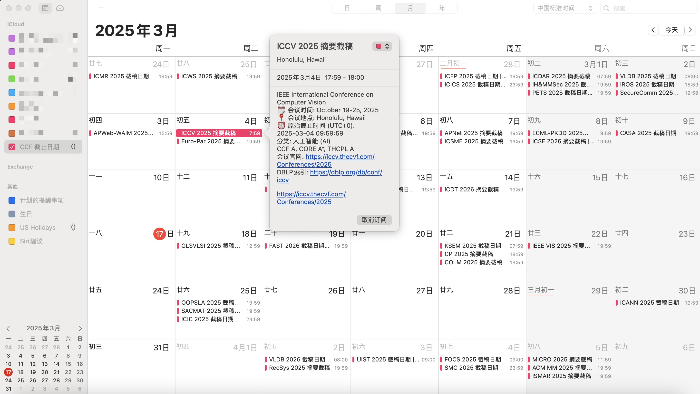
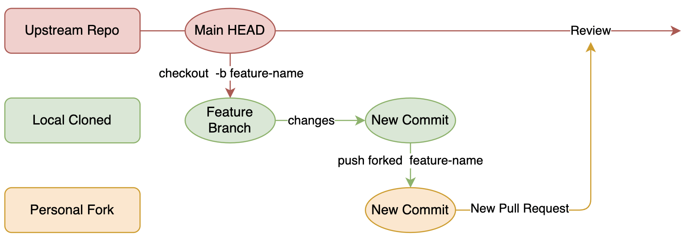

# CCF-Deadlines

[](https://github.com/ccfddl/ccf-deadlines/blob/main/LICENSE)
[](https://github.com/ccfddl/ccf-deadlines/commits/main)
[](https://github.com/ccfddl/ccf-deadlines/pulls)

English | [简体中文](./README.zh-CN.md)

Help researchers track deadlines of conferences recommended by [China Computer Federation (CCF)](https://www.ccf.org.cn/).

<table>
  <tr>
    <td align="center"><b><a href="https://ccfddl.github.io/">Website Preview<br>(Main Site)</a></b></td>
    <td align="center"><b><a href="https://ccfddl.top/">Tabular Preview</a><br>No Ladder Required</b></td>
    <td align="center"><b><a href="https://github.com/ccfddl/ccf-deadlines/tree/main/cli">PyCli Preview</a><br>Work In Progress</b></td>
  </tr>
  <tr>
    <td align="center"></td>
    <td align="center"></td>
    <td align="center"></td>
  </tr>
</table>

<table>
  <tr>
    <td align="center"><b><a href="https://github.com/ccfddl/ccf-deadlines/tree/main/.readme_assets/applet_qrcode.jpg">Wechat Applet</a><br>Work In Progress</b></td>
    <td align="center"><b><a href="https://www.raycast.com/ViGeng/ccfddl?via=ViGeng">Raycast Extension</a><br>Available Now</b></td>
    <td align="center"><b><a href="https://github.com/superpung/swiftbar-ccfddl/">SwiftBar Plugin</a><br>Available Now</b></td>
  </tr>
  <tr>
    <td align="center"></td>
    <td align="center"></td>
    <td align="center"></td>
  </tr>
</table>

**No More Finding and Time Conversion on Your Own!**

## iCal Subscription:

- English: `https://ccfddl.com/conference/deadlines_en.ics`
- 简体中文: `https://ccfddl.com/conference/deadlines_zh.ics`



The filter is mapped to the name of iCal file in the following rules:

- one filter: `deadlines_en.ics` and `deadlines_zh.ics`
- two filters: `deadlines_{lang}_{rank}.ics` and `deadlines_{lang}_{sub}.ics`
- common filters: `deadlines_{lang}_{rank}_{sub}.ics`

For example, given filter: lang=zh, sub=AI,CG, ccf=A,thcpl=A, then it will refer to `deadlines_zh_ccf_A_AI.ics`, `deadlines_zh_ccf_A_CG.ics`, `deadlines_zh_thcpl_A_AI.ics` and `deadlines_zh_thcpl_A_CG.ics`.


## Add/Update a conference

Contributions are welcomed and greatly appreciated!

To add or update information:

- Fork the repo
- Add/Update the yml file of conference/conf_type/conf_name.yml
- Send a [pull request](https://github.com/ccfddl/ccf-deadlines/pulls)

Tips: check [conferences recommended](https://www.ccf.org.cn/Academic_Evaluation/By_category/) or review [pdf](.readme_assets/ccf_recommended_2022.pdf)
## Conference Entry File
Example file: conference/DB/sigmod.yml

```yaml
- title: SIGMOD
  description: ACM Conference on Management of Data
  sub: DB
  rank:
    ccf: A
    core: A*
    thcpl: A
  dblp: sigmod
  confs:
    - year: 2022
      id: sigmod22
      link: http://2022.sigmod.org/
      timeline:
        - deadline: '2021-07-02 17:00:00'
          comment: 'first round'
        - deadline: '2021-09-15 17:00:00'
          comment: 'second round'
      timezone: UTC-8
      date: June 12-17, 2022
      place: Philadelphia, PA, USA
```

Description of the fields:
<table>
   <tr>
      <th colspan="3">Field name</th>
      <th>Description</th>
   </tr>
   <tr>
      <td colspan="3"><code>title</code>*</td>
      <td>Short conference name, without year, uppercase</td>
   </tr>
   <tr>
      <td colspan="3"><code>description</code>*</td>
      <td>Description, or long name, with no session</td>
   </tr>
   <tr>
      <td colspan="3"><code>sub</code>*</td>
      <td>The category that the conference is labeled by CCF. See the matching table below</td>
   </tr>
   <tr>
      <td rowspan="3"><code>rank</code>*</td>
      <td colspan="2"><code>ccf</code>*</td>
      <td>The level that the conference is ranked by CCF, e.g., <code>A</code>, <code>B</code>, <code>C</code>, <code>N</code></td>
   </tr>
   <tr>
   <td colspan="2"><code>core</code></td>
   <td>The level that the conference is ranked by CORE, e.g., <code>A*</code>, <code>A</code>, <code>B</code>, <code>C</code>, <code>N</code></td>
   </tr>
   <tr>
   <td colspan="2"><code>thcpl</code></td>
   <td>The level that the conference is ranked by TH-CPL, e.g., <code>A</code>, <code>B</code>, <code>N</code></td>
   </tr>
   <tr>
      <td colspan="3"><code>dblp</code>*</td>
      <td>The suffix in dblp url, e.g., <code>iccv</code> in https://dblp.uni-trier.de/db/conf/iccv</td>
   </tr>
   <tr>
      <td rowspan="9"><code>confs</code></td>
      <td colspan="2"><code>year</code>*</td>
      <td>Year the conference is happening</td>
   </tr>
   <tr>
      <td colspan="2"><code>id</code>*</td>
      <td>conference name & year, lowercase</td>
   </tr>
   <tr>
      <td colspan="2"><code>link</code>*</td>
      <td>URL to the conference home page</td>
   </tr>
   <tr>
      <td rowspan="3"><code>timeline</code>*</td>
      <td><code>abstract_deadline</code></td>
      <td>Abstract deadline if applicable, optional</td>
   </tr>
   <tr>
      <td><code>deadline</code>*</td>
      <td>Deadline, in the format of <code>yyyy-mm-dd hh:mm:ss</code> or <code>TBD</code></td>
   </tr>
   <tr>
      <td><code>comment</code></td>
      <td>Some comments on the conference, optional</td>
   </tr>
   <tr>
      <td colspan="2"><code>timezone</code>*</td>
      <td>Timezone of deadline, currently support <code>UTC-12</code> ~ <code>UTC+12</code> & <code>AoE</code></td>
   </tr>
   <tr>
      <td colspan="2"><code>date</code>*</td>
      <td>When the main conference is happening, e.g., Mar 12-16, 2021</td>
   </tr>
   <tr>
      <td colspan="2"><code>place</code>*</td>
      <td>Where the main conference is happening, e.g., <code>city, country</code></td>
   </tr>
</table>

Fields marked with asterisk (*) are required.

The matching table:

| `sub` | Category name                                                     |
| ----- | ----------------------------------------------------------------- |
| `DS`  | Computer Architecture/Parallel Programming/Storage Technology     |
| `NW`  | Network System                                                    |
| `SC`  | Network and System Security                                       |
| `SE`  | Software Engineering/Operating System/Programming Language Design |
| `DB`  | Database/Data Mining/Information Retrieval                        |
| `CT`  | Computing Theory                                                  |
| `CG`  | Graphics                                                          |
| `AI`  | Artificial Intelligence                                           |
| `HI`  | Computer-Human Interaction                                        |
| `MX`  | Interdiscipline/Mixture/Emerging                                  |


## Community activity 


## Contribution

Maintained by [@jacklightChen](https://github.com/jacklightChen), [@0x4f5da2](https://github.com/0x4f5da2), [@kzoacn](https://github.com/kzoacn), [@cubercsl](https://github.com/cubercsl), [@spingARbor](https://github.com/spingARbor), [@liborui](https://github.com/liborui), [@PAN-Ziyue](https://github.com/PAN-Ziyue), [@xuhangc](https://github.com/xuhangc), [@RyunMi](https://github.com/RyunMi), [@Lukangkang123](https://github.com/Lukangkang123), [@oliverck](https://github.com/oliverck), [@fffmath](https://github.com/fffmath), [@Allenpandas](https://github.com/Allenpandas), [@yuang-chen](https://github.com/yuang-chen), [@hepengfei5709](https://github.com/hepengfei5709), [@ViGeng](https://github.com/ViGeng), [@QianpengLi577](https://github.com/QianpengLi577).

Inspired by [ai-deadlines](https://aideadlin.es/).

### Best Practice

We recommend branch-based workflow, which is a common practice in open source projects.
As shown in the figure below, The basic idea is to create a new branch for each feature or bug fix. Then this new branch can be pushed to forked repository.
All changes will be merged into upstream main branch through pull requests.

<!-- make it smaller -->
<!--  -->


## License

[](https://app.fossa.com/projects/git%2Bgithub.com%2Fccfddl%2Fccf-deadlines?ref=badge_large)
