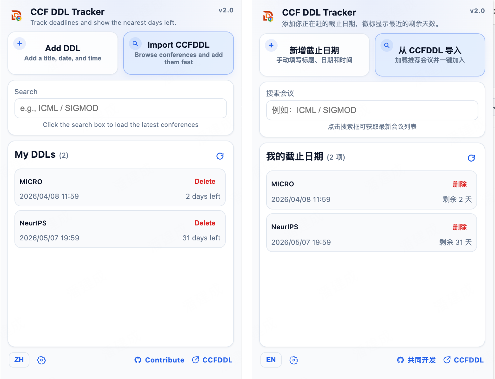

  

  # CCF DDL Tracker

  轻量的 Chrome 扩展，用于管理 CCF 相关会议截止日期，支持手动添加、CCFDDL 导入和本地提醒。

  **版本:** `v2.0`

  [English Version](README.md) ·
  [Chrome Web Store](https://chromewebstore.google.com/detail/fnnpcnlkehcbickmdmepjpjimgcleidd?utm_source=item-share-cb) ·
  [Chrome 扩展说明](chrome/README.md) ·
  [CCFDDL 数据源](https://github.com/ccfddl/ccf-deadlines) ·
  [项目仓库](https://github.com/jaychempan/ccf-ddl-tracker)

---

## 预览

  

v2.0 的 popup 更强调紧凑和高效：顶部双入口卡片、默认常驻的导入面板、悬浮会议选择层、底部快捷入口，以及轻量设置面板都集中在同一视图里。

---

## 安装

### Chrome Web Store

可直接从 Chrome 应用商店安装：

  

### 开发者模式安装

1. 打开 Chrome，进入 `chrome://extensions/`。
2. 打开 `开发者模式`。
3. 点击 `加载已解压的扩展程序`。
4. 选择本仓库下的 [`chrome/`](chrome/) 目录。
5. 固定到工具栏后点击图标即可使用。

  
需要更细的扩展说明？

  可查看 [chrome/README.md](chrome/README.md)。

---

## 核心功能

- **原生贴靠弹窗**：点击扩展图标后，会直接打开紧凑的 Chrome popup，而不是单独窗口。
- **手动添加 + 导入会议**：既可以新增自定义截止日期，也可以从 CCFDDL 导入推荐会议。
- **官网直达**：导入的会议会保留官网链接，加入列表后可直接点击打开会议官网。
- **中英双语**：可在底部工具栏中切换中文和英文界面。
- **显示设置**：支持 `24 小时 / 12 小时` 时间制，以及 `年月日 / 月日年` 日期顺序切换。
- **仅本地存储**：所有数据都保存在 `chrome.storage.local` 中，不依赖账号或云同步。

---

## 自定义

- **语言**：可在 popup 底部切换中文和英文。
- **时间制式**：可在设置面板中选择 `24 小时` 或 `12 小时（AM/PM）`。
- **日期顺序**：可切换 `YYYY/MM/DD` 或 `MM/DD/YYYY`。
- **导入会议卡片**：导入后的会议可加入个人列表，并支持直接跳转会议官网。

---

## 数据来源与隐私

- **主数据源**：[`ccfddl/ccf-deadlines`](https://github.com/ccfddl/ccf-deadlines)
- **回退数据源**：当 GitHub 数据不可用时，回退到 CCFDDL ICS
- **存储方式**：`chrome.storage.local`
- **隐私**：无账号、无云同步、无遥测

---

## 开发

- 仓库：<https://github.com/jaychempan/ccf-ddl-tracker>
- Chrome 扩展说明：[chrome/README.md](chrome/README.md)
- 技术栈：Manifest V3、Vanilla JavaScript、`chrome.storage.local`
- 共同开发：欢迎提交 Issue 和 Pull Request

---

## 更新日志

  
<strong>v2.0</strong> - 界面重构、导入优化、设置增强与版本标识

  - 重构 popup 布局，改为更紧凑的双入口卡片和底部工具栏
  - 导入面板默认常驻，搜索框点击后弹出悬浮推荐列表
  - 导入会议支持保留官网链接，加入“我的截止日期”后可点击卡片打开官网
  - 新增显示设置，支持 `24 小时 / 12 小时` 和 `年月日 / 月日年` 两组偏好
  - 弹窗右上角增加 `v2.0` 版本标记，并同步升级扩展版本号

  
<strong>v1.0.1</strong> - 刷新与剩余天数修复

  - 修复日期无法自动更新的问题
  - 新增手动刷新按钮
  - 修正当天截止任务显示为 `0 天`

---

## License

MIT License
