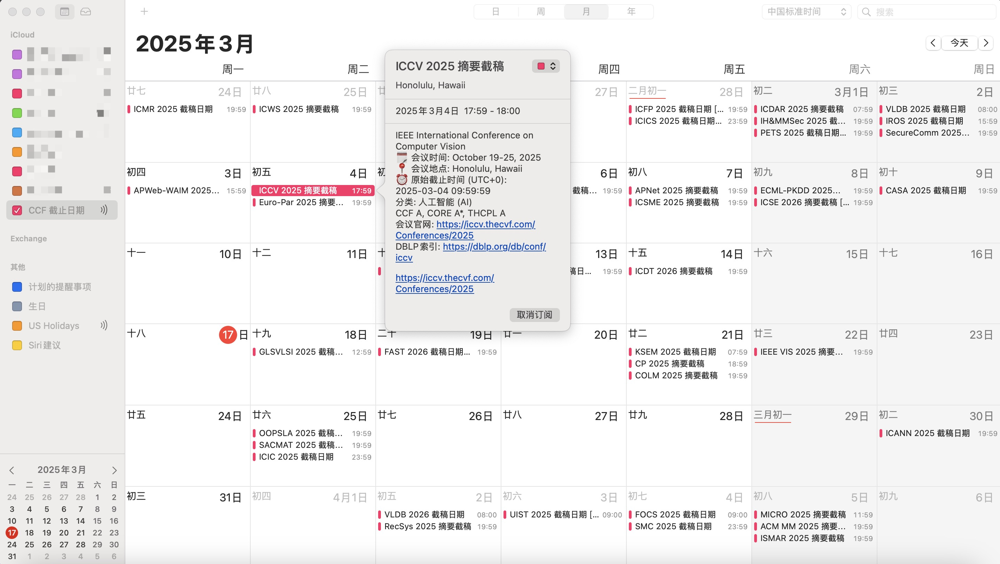

## iCal Subscription:

- English: `https://ccfddl.com/conference/deadlines/deadlines_en.ics`
- 简体中文: `https://ccfddl.com/conference/deadlines/deadlines_zh.ics`

Calendar (`.ics`) and RSS (`.xml`) feeds are published in `/conference/deadlines/`. Existing `/conference/deadlines_*.ics` and `.xml` subscriptions redirect to the new folder through the Cloudflare Worker.

The deployment generates files directly in that folder using `--output-dir public/conference/deadlines`. Without `--output-dir`, the CLI still writes to the current directory.

The filter is mapped to the name of iCal file in the following rules:

- no filter: `deadlines_en.ics` and `deadlines_zh.ics`
- one filter: `deadlines_{lang}_{ccf_rank}.ics`, `deadlines_{lang}_{core_rank}.ics`, `deadlines_{lang}_{thcpl_rank}.ics`, or `deadlines_{lang}_{sub}.ics`
- two filters: any ordered pair among `ccf_rank`, `core_rank`, `thcpl_rank`, and `sub`
- three filters: any ordered triple among `ccf_rank`, `core_rank`, `thcpl_rank`, and `sub`
- four filters: `deadlines_{lang}_{ccf_rank}_{core_rank}_{thcpl_rank}_{sub}.ics`

For example, given filter: lang=en, core=A, thcpl=B, sub=SE, it will refer to `deadlines_en_core_A_thcpl_B_SE.ics`.

For `A*`, the generated filename uses `Astar`, for example `deadlines_en_core_Astar_SE.ics`.
